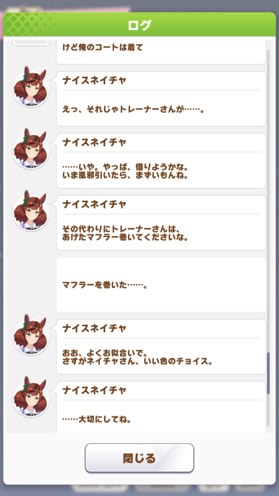
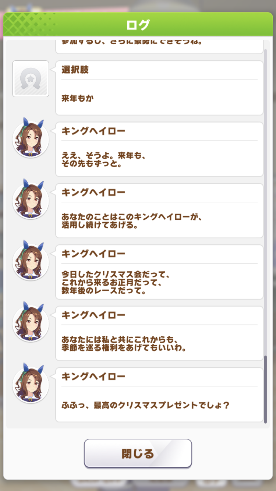

[アスタルテ アドベントカレンダ− 2022](https://adventar.org/calendars/7410) DAY23

最近「話が長い」とか逆に「端折りすぎてわからん」とかよく言われるので、PREP法なるものを用いて中学生の作文風にまとめました。

# 機能語の文化史 　～「だわロリ」の時代

古山キリヲ(khirio@kirishima.cloud)

「だわ」という語尾は、古臭いを通り越して、一周回って新しい表現になりつつある。

日本において、日常的に「〜だわ」と喋る女性はほとんどいない。
しかし、フィクションの中では未だ使われ続けている。

例えばアニメや小説。

学園もので「だわ」口調なんぞ興醒めである。
今時「だわ」などと言う語尾で喋る女子はいない。
妙齢の女性か、新宿二丁目でもなければ。

あるいは実写。

刑事ドラマなんかで少女の口から「だわ」など言われた日には、もはや目も当てられない。流石にそこは、時代に合わせてほしいものだ。

現実の日本において絶滅寸前である「だわ」口調。
しかしなぜ、フィクションにおいては生き残っているのか、
今日はそれを考えていこう。

## 1. 役割語とは

本稿では便宜上、「〜わ、だわ、わよ」をまとめて「だわ」口調と呼ぶこととする。

尾崎紅葉によると「〜だわ」の始まりは、西国から来た下級武士の娘の口調を明治の女学生が真似たことであるそうな。現実に使われていた時期もあるが、1980年ごろを境に、徐々に話者が減っていったとのこと。

時代劇や落語の描写を信じるならば、女性の口調は次のように変化していったことになる。明確に分けられるわけではなく、地域や社会地位の関係で、オーバーラップしていることが想定される。

- 江戸後期～大正：～よ、～だよ（下町ことば）
- 明治～昭和中期：～わ、だわ、わよ（山の手ことば）
- 昭和後期～平成後期：～だよ、じゃん（武蔵ことば）
  
（本稿では詳しく扱わないが、「だよ」が時代を経て、若者言葉として復活しているのは興味深い）

現実での話者が少なくなる一方、小説をはじめとするテキストにおいて「だわ」口調は、人物の性別を明示するために使われ続けてきた。
この手の創作物の中のみで使われる語尾のことを、俗に女性語（役割語）と呼ぶ。
https://www.wikiwand.com/ja/%E5%A5%B3%E6%80%A7%E8%AA%9E

老人を表すために用いられる「わし〜じゃぞ」も、役割語の一種である

本来は、テキストを補完するために用いられた役割語。ではなぜ、イラストや映像がつく時代においても残っているのか。

## 2. 「東方」と役割語

東方Projectでは、25年経った今も「だわ」は現役だ。
主人公の霊夢も、毎回登場する新キャラもほとんど「だわ」口調で喋る。
幻想郷は明治17年に外界から隔絶されたのだから、これに関しては何らおかしくはない。

問題は、外界の住人であり1999年生まれのすみぺ会長（宇佐見菫子）も「だわ」口調であること。彼女の台詞は、二次創作では現代的な口調に改変されることが多い。
また、22世紀の秘封倶楽部（蓮子・メリー）も「だわ」と喋る。こちらは二次創作においても、原作に準拠した口調で描かれることが多い。

これに関しては未だ考察の余地がある。単なる筆の癖なのか、それとも何か深い意味があるのか。

## 3. 時代と役割語

先ほど「生き残っている」と書いたが、ただ化石のように昔のまま残っているわけではない。
フィクションにおける役割語の使われ方は、時代を経て少しずつ変化している。
いくつかの作品を例にとって見ていこう。

### 3-1. 新世紀エヴァンゲリオン（1995年)

登場する全ての女性キャラのセリフに「だわ」が使われている。
真逆の性格である綾波レイ、惣流アスカの二人も例外ではない。
この頃はまだ、性格に依らず、全ての女性キャラのセリフに「だわ」が用いられていた。

### 3-2. 涼宮ハルヒの憂鬱（原作：2003年、アニメ：2006年）

2000年代に入ると、ライトノベルおよびそれを原作としたアニメ作品が続々と登場する。それに伴い、女性キャラの語尾は指数関数的に多様化していく。
おっとり（〜なの、なんだ）、上品（です、ます）、無機質（体言止め）、姉御肌、のじゃロリなどなど。

2000年以前から存在はしていたかもしれないが、目に見えて流行り出したのはこの頃のはず。

本作で「だわ」口調で喋るのは、メインキャラクターのうち、勝気な性格であるハルヒのみである。

### 3-3. Steins;Gate（原作：2009年、アニメ：2011年）

この作品を観たとき、まず驚いたのがリアリティである

厨二病のオカリン（岡部倫太郎）や、ネットスラングを喋るダル（橋田至）に目が行きがちだが
（実際、TwitterやLINEの台頭により、ネットスラングが現実に侵食し始めてた）

この作品では「だわ」はほとんど出てこない。
メインキャラクターのうち、「だわ」と発する人物は誰もいない。
ツンケンした「だわ」系のキャラクターであるクリス（牧瀬紅莉栖）も、である。

いわば機能語のシンギュラリティ（特異点）である。
多少のキャラ付けはあれど、みな現実と同じ口調で話している。
これがあのリアリティと没入感を生んでいるのだ。

そんな中でも、唯一「だわ」が登場する場面がある。
「ラウンダー」なる武装組織（の秋葉原支部）の元締め、FBから届いたメールの文面。

ネタバレに配慮しつつ言うと、FBの正体は男性である。

「ある人物が、人を操るにあたって都合が良いために、女性を演じている」ことを表現するため、わざと「だわ」が使われている。

### 3-4. FINAL FANTASY VII Remake（原作：1997年 リメイク：2020年）

時代による語尾の変化という意味では、この作品が一番わかりやすいであろう。

コルネオを尋問をする際の、ティファとエアリスの脅し文句を例に、原作とリメイク版の台詞回しを比較してみる。

原作では
- 「すりつぶすわよ」
- 「ねじり切っちゃうわよ」

性格の違う２人の両方に「だわ」口調が使われている。

一方リメイク版では
- 「すりつぶすよ」
- 「ねじり切っちゃおうか」

と、両方とも語尾が変更されており、2人の性格が違和感なく反映されている。

https://wikiwiki.jp/ffdic/%E3%82%BB%E3%83%AA%E3%83%95/%E3%80%90%E3%81%99%E3%82%8A%E3%81%A4%E3%81%B6%E3%81%99%E3%82%8F%E3%82%88%E3%80%91

### 3-5. ウマ娘プリティーダービー（アニメ：2018年、アプリ：2021年）

2010年代に入ると、スマートフォンの普及とともにソーシャルゲーム（ソシャゲ）が台頭する。
それに伴い、女性キャラの語尾は再び「だわ」をベースとしたものに回帰し始める。なぜなら数十名、ともすれば数百名を超えるキャラクターが登場するのだ。各キャラクターの個性を出すためには、機能語のバーゲンセールとならざるを得ない。藁にもすがる、ならぬ、「だわ」にもすがる状況である。

ウマ娘も例外ではなく、過去の有名なキャラクターの口調を真似てみたり、
時代がかった言い回しを用いたり（所謂のじゃロリ。ウマ娘には登場しない）、お嬢様だったり、江戸っ子だったり、はたまたグリム童話の老婆のようであったり、平成後期のパリピだったり。

本来年上であるはずの馬（を元にしたキャラ）が現代的な口調で喋り、それより年下の馬が「だわ」口調で喋るという倒錯も起きている。

そんな中で（さりげなく）異彩を放っているのがナイスネイチャである。

「ゆるっと無気力、でも内に秘めたものがある」という、コッテコテの平成っ子なのだが、なにせ語尾の自然さがすごい。マジでその辺にいそう。

 
 

語尾砂漠のオアシス

  
民俗学的には、これは「80~10年代の口調」となるのだろう。

いずれは「〜じゃん」も古臭い・平成っぽい語尾と言われる時代が来るかもしれない。いや、もうすでに来ているかも。

ちなみに実際のナイスネイチャ本馬は1988年生まれ。未だご存命で、御歳なんと34歳。人間で言えば約110歳である。金さん銀さんならぬ銅さん（ブロンズコレクターだけに）

***

でも一番好きなのはキングヘイロー。
ガッツリ語尾に「だわ」使ってるけど。

娘なのに「キング」とはこれ如何に。
あと瞳が美しい（語尾の話どこ行った）

 
 

愛おしや

  
一見すると、単なるキャラ立てのための「だわ」に見える。
しかし一方で、こんな解釈もできるだろう。

勝気でプライド高く、でも繊細さが見え隠れする。

何度打ちのめされても、立ち上がる。己の進むべきの道を切り拓くため。

そんなキング自身が、己を鼓舞するための「だわ」だと。

──明日、2022年12月25日は有馬記念。
みんなでキングの孫、イクイノックスの勇姿を見届けよう。

# 4. [ワーク]機能語を含む台詞の書き換え

最後に、1つ課題を解いてもらいたい。
- 次のセリフをだわを使わずに書き換えよ。ただし元のニュアンスを損なわないようにすること。

- 「いいわよ」

模範解答は「どうぞ」といったところか。しかし、これでも削ぎ落とされてしまっているニュアンスがある。

では、次の問題は？
- 「ありえないわ」

答えは読者の手に委ねるとしよう。

# 5. まとめ

「のじゃロリ」が話題になったように、これからは個性として「だわ」が使われる時代。すなわち「だわロリ」の時代が来る。

そう、「だわ」は一周回って新しい表現になりつつあるのだ。

秘封倶楽部が「だわ」口調で喋るのも、この新しい表現の先取りなのかもしれない。

